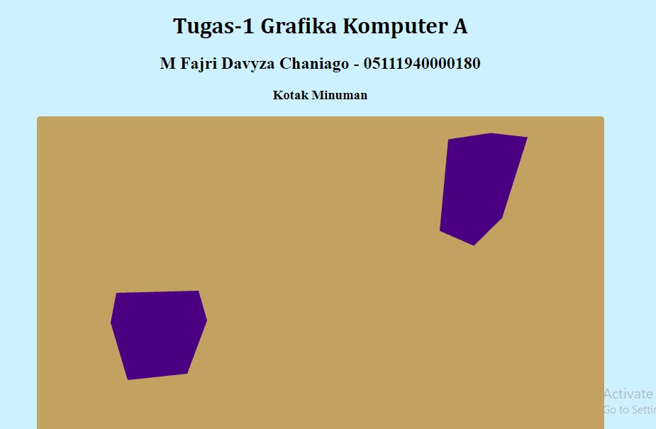
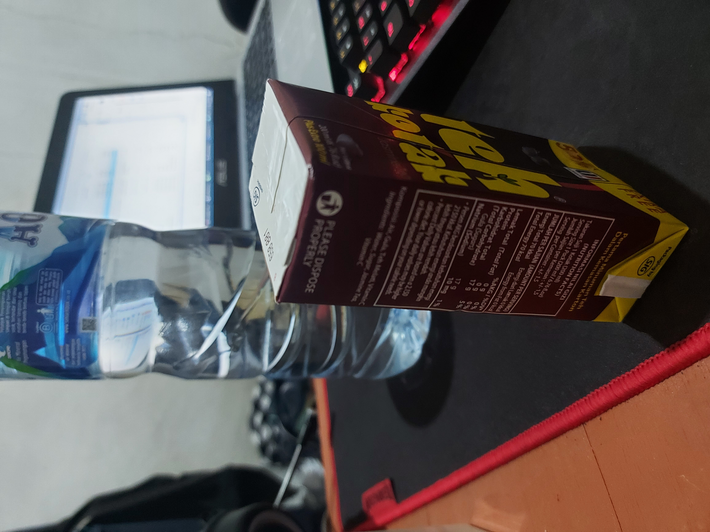

### 📗 Tugas 1 Grafkom A

M.Fajri Davyza Chaniago  
05111940000180
 

Nama benda : Kotak Minuman  
 
Berikut link untuk Melihat hasilnya : <a href="https://cg2021a.github.io/tugas-1-mfajridc/">Hasil Page</a>
 
Hasil WEBGL tampak depan atas (kiri) dan tampak kiri atas (kanan) :  

 
Foto dari sudut depan atas :  

 
Foto dari sudut belakang atas :  

 
Foto dari sudut kanan atas :  

 
Foto dari sudut kiri atas :  

### 📗 Tugas 2 Three-JS Grafkom A 

Dalam hal ini saya membuat beberapa objek geometri yang sekiranya menggunakan animasi yang dapat bergerak 
dan juga menggunakan beberapa jenis light . kemudian saya menggunakan beberapa material seperti MeshPhongMaterial, MeshStandardMaterial, MeshPhysicalMaterial.
 
<frame src="https://cg2021a.github.io/tugas-1-mfajridc/tugasjs/" width="800px" height="600px"></frame>
Berikut link untuk Melihat hasilnya : <a href="https://cg2021a.github.io/tugas-1-mfajridc/tugasjs/">Hasil Page</a>

### 📗 Tugas 3 User Interaction Three-JS Grafkom A 

Tugas kali ini merupakan penerapan dari materi user interaction (three-js) yang dimana objek box akan bertambah, kemudian terdapat perubahan kecepatan dan yang terakhir box akan menjadi warna putih ketika di pilih dan berotasi.

 
<frame src="https://cg2021a.github.io/tugas-1-mfajridc/User%20Interaction%20-%20Three%20js/" width="800px" height="600px"></frame>
Berikut link untuk Melihat hasilnya : <a href="https://cg2021a.github.io/tugas-1-mfajridc/User%20Interaction%20-%20Three%20js/">Hasil Page</a>

### 📗 Tugas 4 Grafkom A 